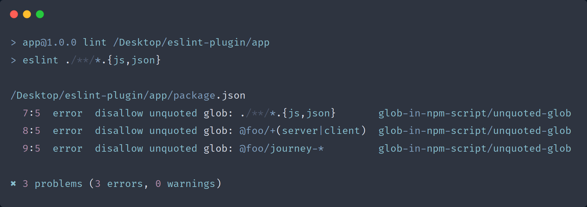

# eslint-plugin-glob-in-npm-script

ESLint plugin to catch unquoted [globs](https://en.wikipedia.org/wiki/Glob_(programming)) in NPM scripts.
Okay, what's wrong with the unquoted globs? It's all about
how the shell expands globstar `**`. This [blog post](https://medium.com/@jakubsynowiec/you-should-always-quote-your-globs-in-npm-scripts-621887a2a784) explains why
we should always quote the globs in NPM scripts in great detail.



## Installation

```
> npm install -D eslint-plugin-glob-in-npm-script
```
**Note**: If you installed ESLint globally (using the `-g` flag) then you must also install `eslint-plugin-glob-in-npm-script` globally.

## Usage

Add `eslint-plugin-glob-in-npm-script` to the plugin section of your `.eslintrc` file.
Optionally you can omit the `eslint-plugin-` prefix if you like to keep it short.

```javascript
{
    plugins: ['glob-in-npm-script']
}
```

Then configure the rule under the `rules` section.

```javascript
{
    rules: {
        'glob-in-npm-script/unquoted-glob': 'error'
    }
}
```

If you want to ignore certain scripts from linting, pass the script names to the `ignoredScripts` option.

```javascript
rules: {
    'glob-in-npm-script/unquoted-glob': ['error', {
        ignoredScripts: ['script-to-ignore'],
    }]
}
```

**Note**: By default, ESLint won't search `.json` files for linting.
Make sure to pass the `--ext` flag with the `.json` extension or
a `glob` that matches `.json` files when running ESLint.

```
eslint . --ext .js,.json
eslint './**/*.{js,json}'
```

## FAQs

#### How does `eslint-plugin-glob-in-npm-script` work?
This plugin relies on a package called [is-glob](https://github.com/micromatch/is-glob) to check whether a
string is a glob. If it's a glob, then it should have quoted.
Otherwise, this plugin reports an error.

## Credits

* [eslint-plugin-json-files](https://github.com/kellyselden/eslint-plugin-json-files)

## License

MIT © [Sureshraj](https://github.com/m-sureshraj)
